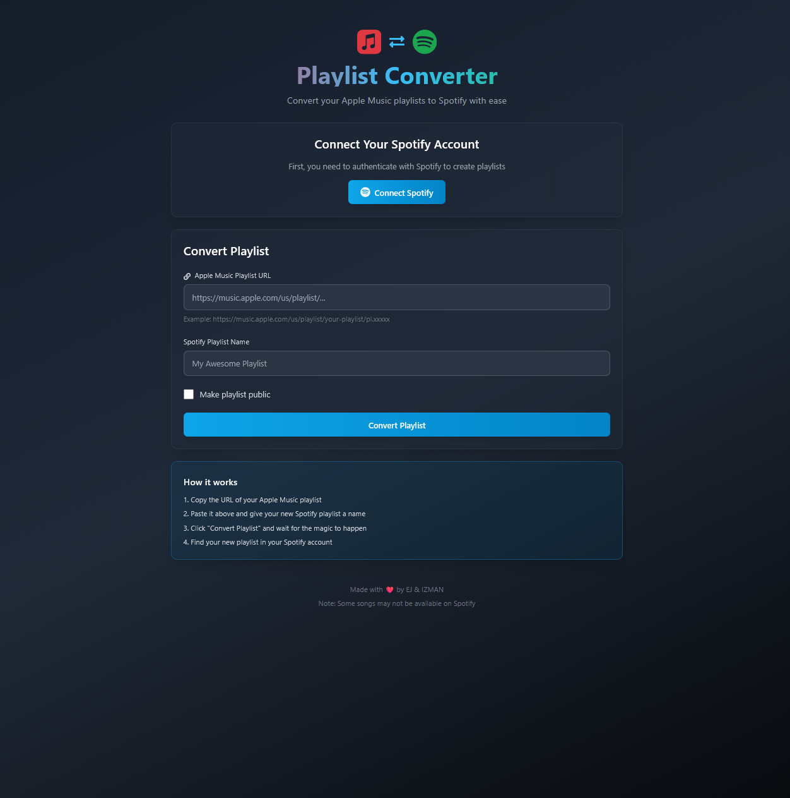

[](https://github.com/primetimetank21/apple-music-playlist-converter/actions/workflows/python-versions.yml)

# 🎵 Apple Music Playlist Converter

Convert your Apple Music playlists to Spotify playlists with ease! This automated full-stack application features a beautiful React frontend and Python FastAPI backend.

## 📸 Screenshot



_Beautiful, modern web interface with dark theme, glassmorphic design, and responsive layout for both mobile and desktop_

## ✨ Features

### Frontend (React + Tailwind CSS)

- 🎨 **Beautiful Modern UI**: Dark theme with glassmorphic cards and gradient effects
- 📱 **Fully Responsive**: Perfect experience on mobile, tablet, and desktop
- ⚡ **Fast & Smooth**: Built with Vite for instant hot reload
- 🎯 **User-Friendly**: Intuitive interface with step-by-step guidance
- 🔄 **Real-time Status**: Live updates during playlist conversion
- ✨ **Smooth Animations**: Polished transitions and loading states

### Backend (Python + FastAPI)

- 🚀 **RESTful API**: Clean, documented endpoints
- 🔄 **Automatic Conversion**: Seamlessly transfer playlists from Apple Music to Spotify
- 🎯 **Smart Matching**: Intelligent song search and matching algorithm
- 📝 **Comprehensive Logging**: Track conversion progress
- 🔒 **Secure**: Environment variables for API credentials
- ⚡ **Efficient**: Asynchronous processing for faster conversions

## 🚀 Prerequisites

Before you begin, ensure you have the following:

- **Python 3.12+** installed on your system
- **Node.js 18+** for the frontend
- **Spotify Developer Account** - [Sign up here](https://developer.spotify.com/)
  - Client ID
  - Client Secret
  - Redirect URI configured in your Spotify app settings
- **Apple Music Playlist URL** - The public URL of the playlist you want to convert

## 📦 Installation

### Backend Setup

#### Option 1: Using UV (Recommended)

```bash
# Clone the repository
git clone git@github.com:Israel-011/apple-music-playlist-converter.git
cd apple-music-playlist-converter

# Install dependencies using uv
make install
```

#### Option 2: Using pip

```bash
# Clone the repository
git clone git@github.com:Israel-011/apple-music-playlist-converter.git
cd apple-music-playlist-converter

# Install dependencies
pip install -r requirements.txt

# Install Playwright browsers
playwright install
```

### Frontend Setup

```bash
cd frontend

# Install dependencies
npm install

# Copy environment variables
cp .env.example .env
```

## ⚙️ Configuration

1. **Backend - Copy the environment template:**

   ```bash
   cp .env.example .env
   ```

2. **Edit the `.env` file with your credentials:**

   ```env
   # Spotify API Credentials
   CLIENT_ID="your_spotify_client_id_here"
   CLIENT_SECRET="your_spotify_client_secret_here"
   REDIRECT_URL="http://localhost:8888/callback"

   # Spotify Scopes (comma-separated)
   SCOPE="playlist-modify-public,playlist-modify-private,user-library-read"

   # Logging Level
   LOG_LEVEL="INFO"
   ```

3. **Get Spotify API Credentials:**
   - Go to [Spotify Developer Dashboard](https://developer.spotify.com/dashboard)
   - Create a new app or use an existing one
   - Copy your Client ID and Client Secret
   - Add `http://localhost:8888/callback` to your Redirect URIs

## 🎮 Usage

### Running the Full Stack Application

**Terminal 1 - Start Backend:**

```bash
# From project root
python src/api.py

# Or with auto-reload
uvicorn src.api:app --reload --host 0.0.0.0 --port 8000
```

Backend will be available at: http://localhost:8000
API docs at: http://localhost:8000/docs

**Terminal 2 - Start Frontend:**

```bash
cd frontend
npm run dev
```

Frontend will be available at: http://localhost:5173

### Using the Web Interface

1. Open http://localhost:5173 in your browser
2. Click "Connect Spotify" to authenticate
3. Paste your Apple Music playlist URL
4. Enter a name for your Spotify playlist
5. Choose public or private
6. Click "Convert Playlist"
7. Wait for the conversion to complete
8. Check your Spotify account for the new playlist!

### Using the CLI (Original Method)

**Using Make:**

```bash
make run
```

**Using Python directly:**

```bash
python src/main.py
```

## 📁 Project Structure

```
apple-music-playlist-converter/
├── frontend/                    # React frontend application
│   ├── src/
│   │   ├── components/         # React components
│   │   │   ├── Header.jsx
│   │   │   ├── LoadingSpinner.jsx
│   │   │   └── StatusDisplay.jsx
│   │   ├── services/           # API service layer
│   │   │   └── api.js
│   │   ├── App.jsx             # Main app component
│   │   └── index.css           # Tailwind CSS styles
│   ├── tailwind.config.js      # Tailwind configuration
│   └── package.json
├── src/                         # Python backend
│   ├── api.py                  # FastAPI application
│   ├── main.py                 # Original CLI script
│   ├── config.py               # Configuration management
│   ├── models.py               # Pydantic data models
│   ├── apple_music_lib/        # Apple Music integration
│   └── logger_lib/             # Logging utilities
├── assets/                      # Images and screenshots
├── .env.example                # Environment variables template
├── requirements.txt            # Python dependencies
├── pyproject.toml              # Project metadata
├── PROJECT_OVERVIEW.md         # Full-stack architecture docs
└── README.md                   # This file
```

## 🛠️ Development

### Backend Development

**Format code:**

```bash
make format
```

**Lint code:**

```bash
make lint
```

**Run tests:**

```bash
make test
```

**Clean build artifacts:**

```bash
make clean
```

### Frontend Development

```bash
cd frontend

# Start dev server
npm run dev

# Build for production
npm run build

# Preview production build
npm run preview
```

### Pre-commit Hooks

This project uses pre-commit hooks to ensure code quality. They are automatically installed when you run `make install`.

To manually run pre-commit hooks:

```bash
pre-commit run --all-files
```

## 🔌 API Endpoints

- `POST /api/convert` - Convert Apple Music playlist to Spotify
- `GET /api/auth/spotify` - Spotify authentication
- `GET /api/auth/spotify/status` - Check auth status
- `GET /api/health` - Health check
- `GET /docs` - Interactive API documentation

## 📊 Logging

The application uses a comprehensive logging system. You can adjust the log level in your `.env` file:

- `DEBUG`: Detailed information for debugging
- `INFO`: General informational messages (default)
- `WARNING`: Warning messages
- `ERROR`: Error messages
- `CRITICAL`: Critical issues

Logs will show:

- Songs successfully added to playlist
- Songs that couldn't be found on Spotify
- API errors and exceptions

## 🛠️ Tech Stack

### Frontend

- React 18 - UI library
- Vite - Build tool and dev server
- Tailwind CSS v3 - Utility-first CSS framework
- Axios - HTTP client
- React Icons - Icon library

### Backend

- Python 3.12+ - Programming language
- FastAPI - Web framework
- Uvicorn - ASGI server
- Pydantic - Data validation
- Spotipy - Spotify API wrapper
- Playwright - Browser automation
- Pytest - Testing framework

## ⚠️ Known Limitations

- Not all songs from Apple Music may be available on Spotify
- Song matching is based on track name and artist, which may occasionally result in incorrect matches
- Rate limiting may apply based on Spotify API usage

## 🤝 Contributing

Contributions are welcome! Please feel free to submit a Pull Request. For major changes, please open an issue first to discuss what you would like to change.

1. Fork the repository
2. Create your feature branch (`git checkout -b feature/AmazingFeature`)
3. Commit your changes (`git commit -m 'Add some AmazingFeature'`)
4. Push to the branch (`git push origin feature/AmazingFeature`)
5. Open a Pull Request

## 📝 To-Do

- [ ] Add command-line argument support for playlist URLs
- [ ] Implement progress bar for conversion status
- [ ] Add support for saving failed song matches
- [ ] Add support for batch conversion (multiple playlists)
- [ ] Implement reverse conversion (Spotify to Apple Music)
- [ ] Add user authentication and session management
- [ ] Deploy to production

## 📄 License

This project is licensed under the MIT License - see the LICENSE file for details.

## 🙏 Acknowledgments

- [React](https://react.dev/) & [Vite](https://vite.dev/) - Modern frontend tools
- [Tailwind CSS](https://tailwindcss.com/) - Utility-first CSS framework
- [FastAPI](https://fastapi.tiangolo.com/) - Modern Python web framework
- [Spotipy](https://spotipy.readthedocs.io/) - Spotify API wrapper
- [Pydantic](https://pydantic-docs.helpmanual.io/) - Data validation
- [Playwright](https://playwright.dev/python/) - Browser automation

## 📧 Contact

Israel Pratt - [@Israel-011](https://github.com/Israel-011)

Project Link: [https://github.com/Israel-011/apple-music-playlist-converter](https://github.com/Israel-011/apple-music-playlist-converter)

---

⭐ If you find this project helpful, please consider giving it a star!
